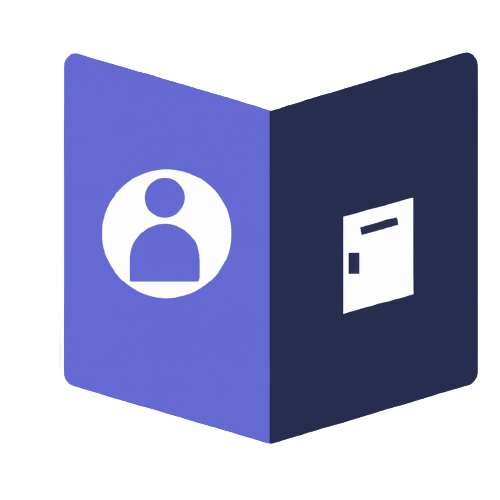
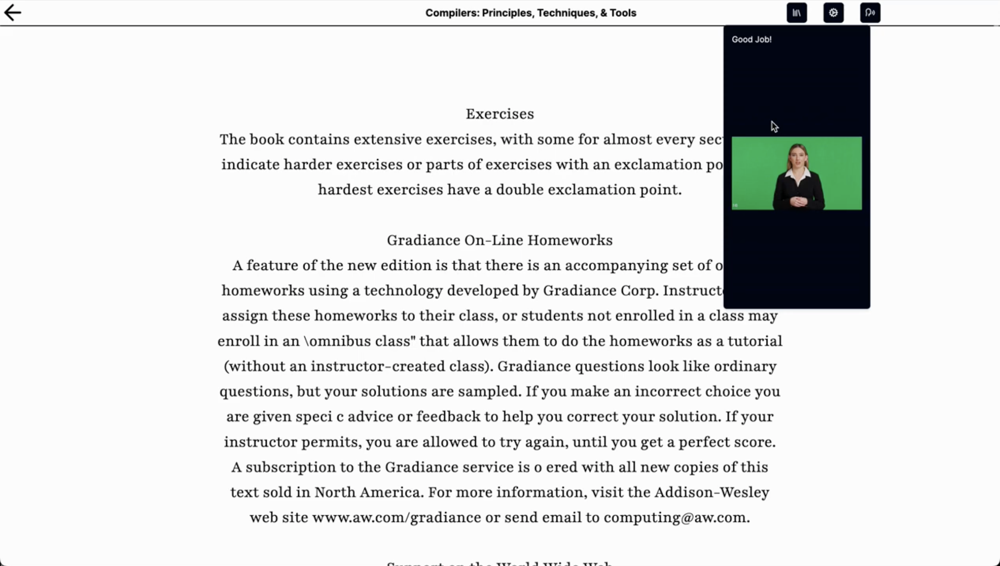

  

<h1 align="center">Bookstacks.ai</h1>

## Table of Contents
- [Demo Video](#demo-video)
- [Introduction](#introduction)
- [Features](#features)
- [Installation](#installation)
- [Usage](#usage)
- [Accessibility Features](#accessibility-features)
- [Contributing](#contributing)

## Demo Video

  

## Introduction
Bookstacks.ai is a web application designed to revolutionize the reading experience. By integrating AI, this platform assists users in reading books, quizzes them on the content, and offers enhanced accessibility features for a seamless reading experience. Additionally, it promotes interactive learning to deepen comprehension and engagement with the material, while providing an accessible enviroment for users with dyslexia.

## Features
AI-Assisted Reading: Utilizes AI algorithms to assist users in reading selected content, and improving comprehension.

Book Quizzing: Generates quizzes based on the content of the books, reinforcing comprehension and knowledge retention.

Accessibility Features:

Text-to-Speech: Converts written text into spoken words, aiding users with visual impairments or learning disabilities.

Font and Theme Customization: Allows users to adjust font styles, sizes, and themes for optimal readability and comfort.

Interactive Learning: Providing readers an interactive reading enviroment which quizzes user on how well they understood the topic.

Interactive Summaries: Provides interactive summaries and annotations to enhance understanding and engagement with the material.
Progress Tracking: Monitors users' progress and suggests personalized reading goals to encourage consistent learning.

Caching
Authentication
This project uses [Auth0](https://auth0.com/) for secure and reliable user authentication. Auth0 provides a universal authentication & authorization platform for web, mobile and legacy applications.

Caching
For caching and session management, we use [Redis Cloud](https://redislabs.com/redis-enterprise-cloud/overview/). Redis Cloud is a fully-managed cloud service for hosting and running your Redis dataset in a highly-available and scalable manner, with predictable and stable top performance.

## Installation
Clone this repository to your local machine.

Navigate to the project directory and install the necessary dependencies using npm install.
Start the application with npm start.
For detailed installation instructions, refer to Installation Guide.

## Usage
Visit the application URL in your preferred web browser.
Create an account or log in.
Browse and select a book from the available library.
Customize the reading settings according to your preferences.
Begin reading and utilize the AI-enhanced features for an improved reading experience.
Engage with quizzes and interactive learning features to reinforce your understanding.
For more detailed usage instructions, refer to User Guide.

## Accessibility Features
The AI-Enhanced Reading Companion is committed to providing an accessible reading experience for all users. The following accessibility features are available:

Text-to-Speech: Enables auditory representation of the text for visually impaired users.
Font and Theme Customization: Allows users to personalize the interface for better readability and comfort.
For a comprehensive guide on accessibility features, refer to Accessibility Guide.

Interactive Learning
The application encourages interactive learning through:

Interactive Summaries: Engage with interactive summaries and annotations to deepen comprehension and retention.
Progress Tracking: Monitor your reading progress and set achievable learning goals.
For tips on optimizing your interactive learning experience, refer to Interactive Learning Guide.

## Contributing
We welcome contributions from the community! If you'd like to contribute to this project, please follow the guidelines outlined in Contribution Guidelines.
